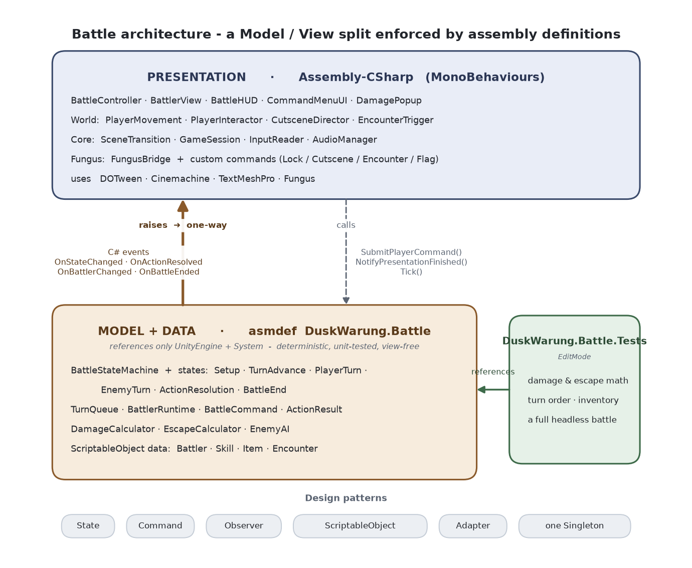
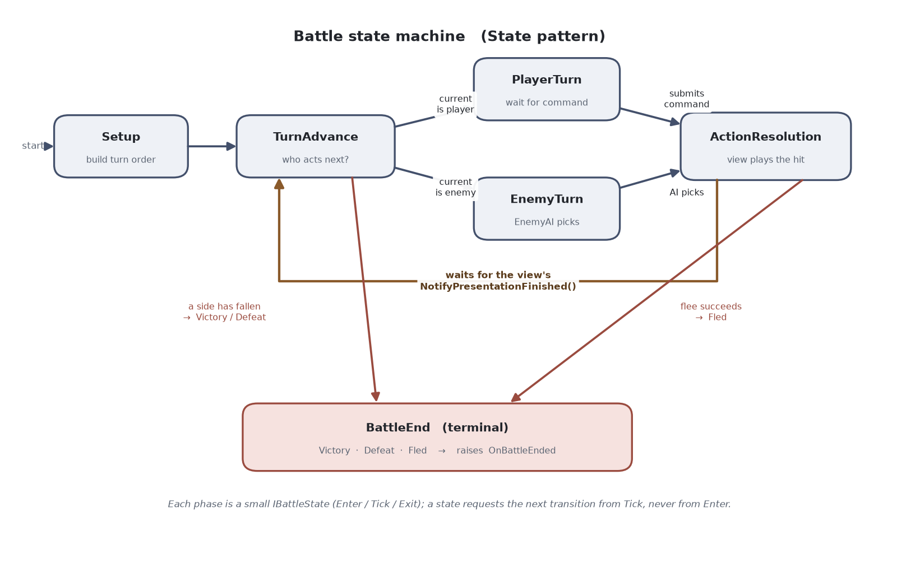
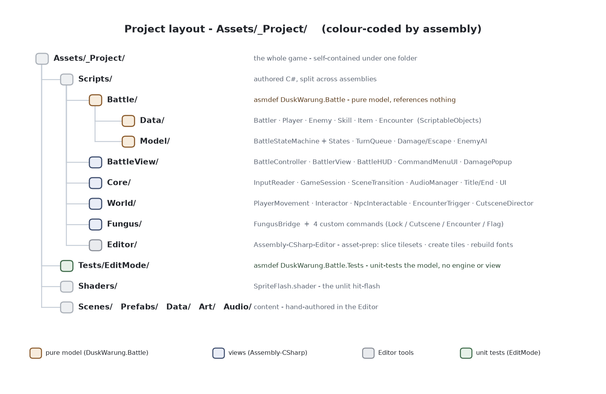

# Dusk at the Warung

A 5-8 minute turn-based JRPG vertical slice, built for the **Toge Productions Game Programmer Pre-Interview Test 2026** by **Malvin Leonardo Hartanto**.

A young traveller stops at a roadside *warung* at dusk. The owner, Bu Sari, warns them not to cut through the bamboo grove after dark. The traveller goes anyway, and a shadow spirit of Javanese folklore blocks the path. One turn-based battle later, the traveller earns safe passage.

The slice covers overworld exploration, an NPC conversation (Fungus), a self-driving cutscene, a flash/fade scene transition into an animated turn-based battle (Attack / Skill / Item / Run), and victory/defeat/end screens.

> **A note on the art.** As this is a programmer test, the focus is the code, and the art is drawn
> from ready-made packs. Every sprite, font, and sound is a downloaded CC0 asset (see
> [CREDITS.md](CREDITS.md)).

## Submission

`.exe` build link:

Prototype video: 

---

## Requirement coverage

| Test requirement | Implemented by |
|---|---|
| Object - **Player** | `Prefabs/World/Player.prefab`, `Scripts/World/PlayerMovement.cs` |
| Object - **NPC** | `Prefabs/World/BuSari.prefab`, `Scripts/World/NpcInteractable.cs` |
| Object - **Enemy** | `Prefabs/Battle/EnemyBattler.prefab`, `Data/Battlers/Enemy_Genderuwo.asset` |
| Object - **Background** | battle backdrop (`battleback1`) + Overworld tilemap |
| **WASD/Arrow** exploration | `Scripts/World/PlayerMovement.cs` + `Scripts/Core/InputReader.cs` |
| **Space** to interact | `Scripts/World/PlayerInteractor.cs` + `IInteractable` |
| **Dialog** | Fungus flowcharts via `Scripts/Fungus/FungusBridge.cs` |
| **In-game cutscene** (avatar self-moves) | `Scripts/World/CutsceneDirector.cs` + `Scripts/Fungus/PlayCutsceneCommand.cs` |
| **Turn-based JRPG battle** | `Scripts/Battle/Model/BattleStateMachine.cs` + `Scripts/BattleView/BattleController.cs` |
| **ScriptableObject** | `Data/` (Skill/Item/Player/Enemy/Encounter) + SO classes in `Scripts/Battle/Data/` |
| **Prefab** | `Prefabs/` (Player, BuSari, PlayerBattler, EnemyBattler, DamagePopup) |
| **Fungus** | Fungus + 4 custom commands + `FungusBridge` + portrait **Characters** + branching **Menu** choices |

---

## Features

- **Overworld exploration** with WASD / arrow-key movement, four-direction facing, and a fade-in
  controls hint.
- **Interaction** with Space or left-click to talk to NPCs and trigger events.
- **Portrait dialogue** driven by Fungus, with name plates, facesets, and a typewriter effect.
- **Branching choices** through in-conversation Menu options (a cosmetic fork that re-converges).
- **Event-flag gating**: the grove battle only begins after the player has spoken to Bu Sari.
- **Self-driving cutscene**: the avatar walks itself to the grove through the same input path the
  player uses.
- **Flash-free scene transitions** via a persistent fade overlay that covers both scenes during a load.
- **Turn-based battle** with Attack / Skill / Item / Run and three outcomes (Victory, Defeat, Flee).
- **Combat feedback**: hit flash, hit-stop, camera shake, recoil, floating damage numbers, HP/MP bars
  with a draining damage chip, and slide-in panels; the HUD hides during narrative.
- **Presentation screens and audio**: a styled title screen, victory/defeat/end screens, and per-scene
  music and sound effects.

## Design considerations

A few player-facing decisions, and the reasoning behind them:

- **Playable with the keyboard alone.** Movement, interaction, dialogue advance, and every
  battle command work from the keyboard, so the game needs no mouse (useful on a laptop or
  trackpad). The mouse is supported as an equal alternative rather than a requirement. The
  battle menu also keeps a command highlighted at all times and jumps the cursor to the
  nearest usable option when one is disabled (for example, a skill with no MP left), so a
  keyboard player is never left without a selection.

- **Guidance instead of walls.** Walking into the grove before speaking to Bu Sari does not
  fail silently; it plays a short hint that points the player back to her. Progression is
  nudged rather than blocked, so a first-time player does not get stuck wondering what to do.

- **Focus during story beats.** The combat HUD fades out while the intro and victory dialogue
  play, then fades back for the fight, so the screen belongs to one thing at a time.

- **Readable turn-based feedback.** Every action reports itself: a hit flash, a brief pause,
  floating damage numbers, and an HP bar that drains a white chip. In a turn-based game the
  player should always be able to read what just happened before the next turn.

- **Low-friction retry.** A defeat is not a hard game over; the traveller wakes back at the
  warung and can attempt the grove again, which suits a short vertical slice meant to be replayed.

## Battle mechanics

Some of these are driven by chance and may not surface during a short playthrough:

- **Damage formula**: `max(1, round((ATK * power - DEF) * variance))`.
- **Damage variance**: every hit rolls plus or minus 10% (a 0.9 to 1.1 multiplier).
- **Critical hits**: a 5% chance to deal 1.5x damage.
- **Turn order** by Speed (fastest first), rebuilt each round, with fallen battlers skipped.
- **MP-gated skill** ("Rengginang toss"): costs MP and is disabled when the player cannot afford it.
- **Consumable item** ("Kelapa Muda"): restores HP and is limited to its remaining charges.
- **Flee odds**: a Run has a 35% base chance, shifted up or down by the speed gap between the two
  battlers.
- **Deterministic combat**: every roll uses a seedable `System.Random`, so a fixed seed reproduces the
  same battle (relied on by the unit tests).

## Technical highlights

- **Model/View split enforced by assembly definitions**: the battle model compiles in an assembly that
  cannot reference any view.
- **Design patterns**: State (the battle FSM), Command (`BattleCommand`), Observer (C# events), and
  ScriptableObject (data-driven definitions).
- **Unit-tested combat**: EditMode tests drive the model headless, including a full battle to
  Victory/Defeat.
- **Event-flag progression**: a `GameSession` flag layer plus a custom `Set Flag` Fungus command.
- **Transition-ready handshake**: incoming scenes wait on `SceneTransition.IsBusy`, so dialogue never
  pops in mid-fade.
- **Custom Fungus commands**: Lock Player, Play Cutscene, Start Encounter, and Set Flag extend the
  designer's toolbox.
- **Presentation kept out of the model**: a `MaterialPropertyBlock` flash shader, DOTween tweens, and
  Cinemachine screen-shake all live in the view layer.
- **Editor asset-prep tooling**: three small helpers slice tilesets, create tile assets, and rebuild the
  pixel-font atlases.

---

## Running it

**Requirements:** Unity **2022.3 LTS** (developed on `2022.3.62f3`).

1. Open the project in Unity Hub (2022.3.x). First import may take a few minutes.
2. Confirm the **Console is clean** (zero errors/warnings).
3. Open `Assets/_Project/Scenes/Title.unity` and press **Play**. (Scene order: `Title` to
   `Overworld` to `Battle` to `End`.)

**Controls:** `WASD` / Arrow keys to move; `Space` **or** left-click to interact, advance dialogue, or start.

## Tests

Pure combat logic is covered by EditMode unit tests:
**Window ▸ General ▸ Test Runner ▸ EditMode ▸ Run All.** They exercise the damage formula (against
the design doc's worked examples), HP/MP/inventory rules, turn ordering, flee odds, and a full
headless battle driven to Victory/Defeat, confirming the model runs without the engine's view layer.

---

## Architecture

The battle is split into a **pure model** and a **presentation layer**, with the boundary enforced
by *assembly definitions* rather than convention: the model cannot reference a view, because its
assembly references nothing that pulls one in.

**Patterns**
- **State**: the battle is a finite-state machine; each phase is a small class with a clear
  `Enter/Tick/Exit`, which reads like the game's own flowchart and forbids illegal transitions.
- **Command**: Attack/Skill/Item/Run are one immutable `BattleCommand`; the state machine resolves any
  of them without caring where it came from (UI or AI).
- **Observer**: the model raises C# events, and every view is a passive subscriber. The model never
  holds a view reference.
- **ScriptableObject** data: battlers, skills, items, and encounters are designer-editable assets.

**The presentation contract (keeping timing out of the model):** the model resolves an action and
raises `OnActionResolved(ActionResult)`; the `BattleController` plays the three-beat reaction (wind-up
lunge, then impact flash with hit-stop, camera shake, and a damage popup, then the HP-bar tween) and
only then calls `NotifyPresentationFinished()`, which lets the FSM advance the turn. Timing lives
entirely in the view; the model stays deterministic.

**Deliberate scope choices:**
- No ScriptableObject event channels: plain C# events are simpler and sufficient here.
- No object pooling: one battle spawns a handful of popups, so pooling would be premature.
- Two intentional globals, each justified: the static `GameSession` (cross-scene hand-off data) and the
  persistent `SceneTransition` (a `DontDestroyOnLoad` fade overlay, the kind of case a singleton
  genuinely fits, since covering *both* scenes' seams during a load is exactly what prevents transition
  flashes). Audio is a per-scene `AudioManager`, not a global.

**Content vs systems:** dialogue lives in Fungus flowcharts and levels in tilemaps, both hand-authored
in the Editor and never in code. Code owns the systems; content is data, so the **programmer** (systems,
tooling, skins), the **game designer** (dialogue, balance), and the **level designer** (map, triggers)
can each work without blocking the others.

**Cutscene: a data-driven director, not Timeline.** The self-driving cutscene is a small
`CutsceneDirector` (an ordered step list: walk-to-waypoint / wait / run a Fungus block). It feeds
scripted input into the *same* `InputReader` the player uses, so the avatar walks through the identical
movement, animation, and collision path; a Timeline Animation track would move the Transform directly
and bypass all of it. It also composes directly with the Fungus dialogue and the battle hand-off.
Timeline is the right tool for long, multi-track, artist-authored cinematics; for a short scripted walk
that must reuse the player's movement, a step list is smaller, dependency-free, and reads top-to-bottom.

## Project layout

The game is self-contained under `Assets/_Project/`. The only third-party folders kept are the **Fungus**
plugin (`Assets/Fungus`), **DOTween** (`Assets/Plugins/Demigiant`), and the two pixel-font sources
(`Assets/Fonts/m5x7`, `monogram`) referenced by the TMP font assets.

## Known limitations and future work

This is a deliberately scoped vertical slice. The current limits, and the natural next steps that build
on the existing systems:

- **One encounter and one enemy.** Encounters, battlers, skills, and items are all ScriptableObjects, so
  adding content is authoring rather than new code.
- **No save system.** The run is a single session; a save/load layer would build on the existing
  `GameSession` state.
- **A single skill and item, with fixed balance.** More skills, items, and status effects would extend
  the model without changing its shape.
- **One-versus-one combat.** A party and a target-selection step are the obvious next additions.
- **Target resolution.** This prototype is optimized for a 1920 × 1080 (1080p) display.

## What I learned from developing this prototype

1. **Treating dialogue as content, not code.** I had built a dialogue system before, but it
   was authored entirely through ScriptableObjects wired up in the Inspector, which was slow
   and tedious to iterate on. Working with Fungus taught me the value of giving writers a
   visual, node-based flowchart: branching conversations are trivial to author, and the story
   can change without touching code. It reframed dialogue for me as content a designer owns
   rather than data a programmer has to hand-wire.

2. **Engineering "game feel" into combat.** This was my first time deliberately building feel
   into a battle. Layering a hit-flash shader, hit-stop, screen shake, and floating damage
   numbers showed me how much a few frames of timing and feedback change how satisfying an
   action is, and how to keep that presentation logic in the view so the combat model stays
   clean and testable.

3. **Designing a testable architecture.** Enforcing a Model/View split with assembly
   definitions, so the battle logic cannot even reference the UI, was new to me. It paid off:
   the combat model became deterministic and unit-testable in isolation, and adding
   presentation polish never risked the game rules. I learned to treat that compile-time
   boundary as a design tool, not just a folder convention.

## Versions (pinned for reproducibility)
| Component | Version |
|---|---|
| Unity | 2022.3.62f3 (2022.3 LTS) |
| Universal RP | 14.0.12 (2D Renderer) |
| Cinemachine | 2.10.7 |
| TextMeshPro | 3.0.7 |
| Fungus | 3.13.8 (snozbot, MIT) |
| DOTween | free (Demigiant) |

## Credits
All third-party assets and their licenses are listed in [CREDITS.md](CREDITS.md).
